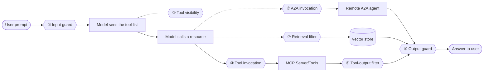

# Where it intercepts: the seven enforcement points along one agent turn

Source of truth: [`README.md`](../README.md). Keep the two in sync.

```mermaid
flowchart LR
    U([User prompt]) --> P1{{"① Input guard"}}
    P1 --> M1[Model sees the tool list]
    M1 -.- P2{{"② Tool visibility"}}
    M1 --> C[Model calls a resource]
    C --> P3{{"③ Tool invocation"}}
    P3 --> T[MCP Server/Tools]
    T --> P4{{"④ Tool-output filter"}}
    P5 --> R([Answer to user])
    C -.-> P6{{"⑥ A2A invocation"}}
    P6 -.-> AG[Remote A2A agent]
    C -.-> P7{{"⑦ Retrieval filter"}}
    P7 -.-> VS[(Vector store)]
    AG --> P5{{"⑤ Output guard"}}
    VS --> P5
    P4 --> P5
```
