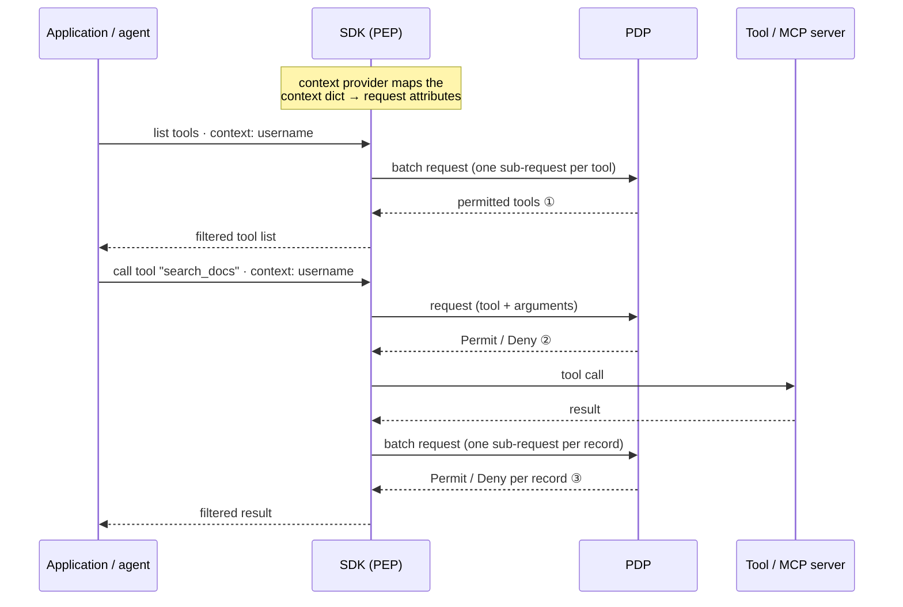

# Request flow, client side (agents, langchain_mcp, rag, direct)

Source of truth: [`docs/architecture.md`](../docs/architecture.md). Keep the two in sync.

```mermaid
sequenceDiagram
    participant C as Application / agent
    participant SDK as SDK (PEP)
    participant PDP as PDP
    participant MCP as Tool / MCP server
    Note over SDK: context provider maps the<br/>context dict → request attributes
    C->>SDK: list tools · context: username
    SDK->>PDP: batch request (one sub-request per tool)
    PDP-->>SDK: permitted tools ①
    SDK-->>C: filtered tool list
    C->>SDK: call tool "search_docs" · context: username
    SDK->>PDP: request (tool + arguments)
    PDP-->>SDK: Permit / Deny ②
    SDK->>MCP: tool call
    MCP-->>SDK: result
    SDK->>PDP: batch request (one sub-request per record)
    PDP-->>SDK: Permit / Deny per record ③
    SDK-->>C: filtered result
```
