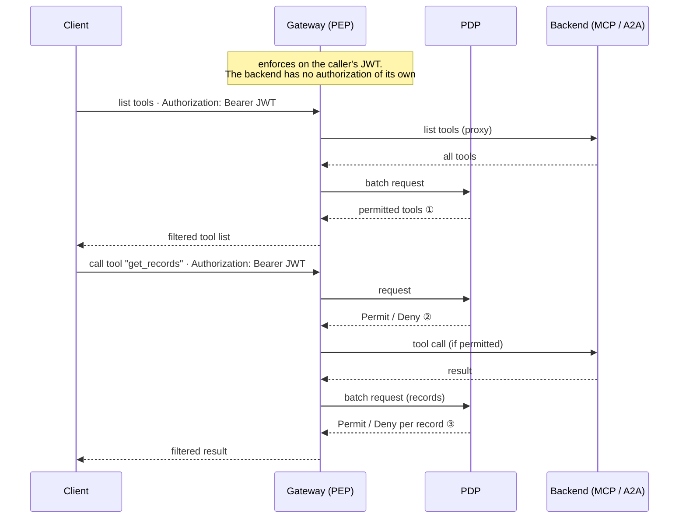

# Request flow through the gateway (reverse proxy in front of MCP / A2A)

Source of truth: [`docs/architecture.md`](../docs/architecture.md). Keep the two in sync.

```mermaid
sequenceDiagram
    participant C as Client
    participant G as Gateway (PEP)
    participant PDP as PDP
    participant B as Backend (MCP / A2A)
    Note over G: enforces on the caller's JWT.<br/>The backend has no authorization of its own
    C->>G: list tools · Authorization: Bearer JWT
    G->>B: list tools (proxy)
    B-->>G: all tools
    G->>PDP: batch request
    PDP-->>G: permitted tools ①
    G-->>C: filtered tool list
    C->>G: call tool "get_records" · Authorization: Bearer JWT
    G->>PDP: request
    PDP-->>G: Permit / Deny ②
    G->>B: tool call (if permitted)
    B-->>G: result
    G->>PDP: batch request (records)
    PDP-->>G: Permit / Deny per record ③
    G-->>C: filtered result
```
