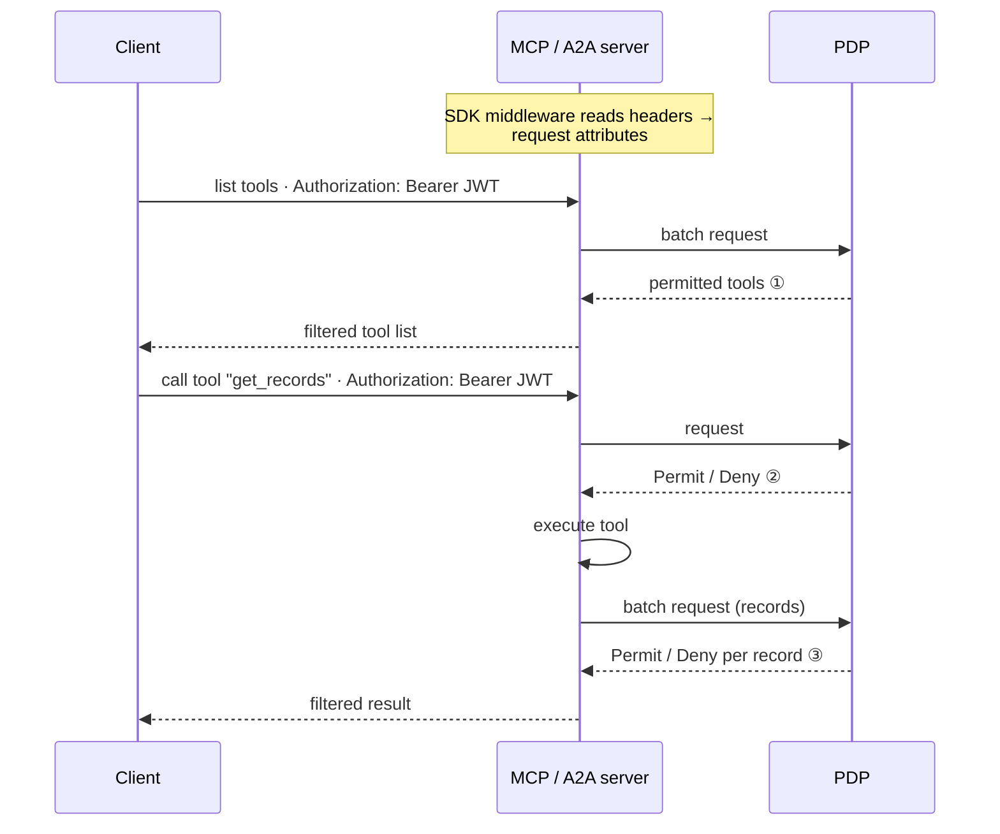

# Request flow, server side (fastmcp, tool_decorator, a2a server)

Source of truth: [`docs/architecture.md`](../docs/architecture.md). Keep the two in sync.

```mermaid
sequenceDiagram
    participant C as Client
    participant S as MCP / A2A server
    participant PDP as PDP
    Note over S: SDK middleware reads headers →<br/>request attributes
    C->>S: list tools · Authorization: Bearer JWT
    S->>PDP: batch request
    PDP-->>S: permitted tools ①
    S-->>C: filtered tool list
    C->>S: call tool "get_records" · Authorization: Bearer JWT
    S->>PDP: request
    PDP-->>S: Permit / Deny ②
    S->>S: execute tool
    S->>PDP: batch request (records)
    PDP-->>S: Permit / Deny per record ③
    S-->>C: filtered result
```
